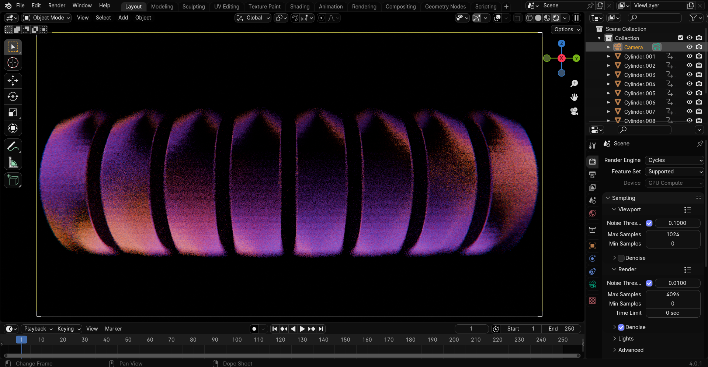

# Modern Space
A Space-Inspired Blender Theme for Blender 4.0.1

## How to Install

1. Download `Space_Black.xml`.
2. Open Blender and navigate to `Edit -> Preferences -> Themes`.
3. Click on `Install...`.
4. Select the previously downloaded `Space_Black.xml` and install it.
